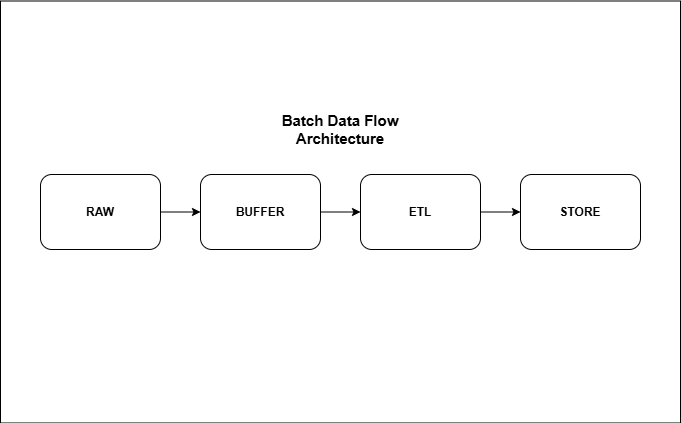
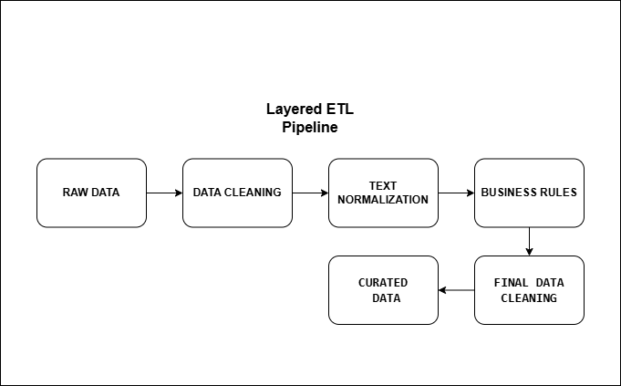

# Solve Clean Engine

An architecture-first data quality engine for deterministic rule execution and
controlled pipeline orchestration.

Organizations spend significant time and resources manually cleaning, validating,
and enriching customer and registration data. Inconsistent formats, incomplete fields, and
rule-based validations often require repetitive work that slows down analytics and operational processes.

This project automates the cleaning, standardization, and enrichment of structured registration data,
reducing manual effort and improving data reliability. Its layered and well-defined architecture ensures that business
rules remain deterministic and testable, enabling the system to scale safely as complexity and data volume grow.

<p align="center">
  
</p>


<details>
<summary><strong>Layered ETL Pipeline</strong></summary>

<br>

<p align="center">
  
</p>

<p align="center">
  <em>Figure 2 — Layered ETL pipeline.</em>
</p>

</details>


<details>
<summary><strong>DATA CLEANING: INITIAL STAGE</strong></summary>

<br>

<p align="center">
  
</p>

<p align="center">
  <em>Figure 3 — DATA CLEANING: INITIAL STAGE.</em>
</p>

</details>


<details>
<summary><strong>TEXT NOMALIZATION</strong></summary>

<br>

<p align="center">
  
</p>

<p align="center">
  <em>Figure 4 — TEXT NOMALIZATION.</em>
</p>

</details>

The final cleaning step consists of a final null normalization.

Note that the NAME PIPELINE is where most of the core logic happens.
This stage performs name cleaning based on controlled vocabularies and predefined rules, and generates CSV log files for
manual review.
These logs are created based on flags such as unusually long names or misplaced email patterns within name fields,
allowing structured human validation when automated rules are not sufficient.


---

## 1.0 Project Motivation

While working as a freelance consultant cleaning spreadsheets and developing ETL pipelines for data cleaning and
normalization, I noticed that I was repeatedly writing the same lines of
code and utility functions to normalize text columns. Name fields, email addresses, and other registration data required
similar validation and transformation patterns across different projects. This repetition led to the idea of building a
reusable and structured solution.

The project started with a simple name-cleaning class and gradually evolved in complexity as new requirements emerged.
What began as a small utility grew into a more organized system with clear boundaries between business rules,
orchestration, and infrastructure concerns.

The specific gap this project fills is the absence of a lightweight, reusable, and architecturally disciplined framework
for cleaning and enriching structured registration data. Instead of isolated scripts tailored to individua spreadsheets,
this project provides a consistent and scalable foundation for applying deterministic rules, standardizing data, and
enabling controlled review workflows.

Applying the tools developed in this project enhances data quality, ensures consistency, and increases overall
reliability across processing workflows.

---

## 2.0 Architecture Overview

This project follows a layered architecture designed to enforce separation of concerns, deterministic rule execution,
and long-term maintainability.

The core principle is simple: **business rules must remain pure, and orchestration must be explicit.**

### Layered Structure

- **domain**

Contains pure business rules and deterministic transformations.
No I/O, no logging, no database access. Fully testable in isolation.

---

- **services**

Coordinates domain logic over structured data (e.g., DataFrames).
Applies rules but does not create new business logic.

---

- **pipelines**

Orchestrates execution flow.
Manages state transitions, error propagation, and composition of services.

---

- **infra**

Handles external interactions such as file systems, databases, and logging backends.
Infrastructure concerns never leak into domain logic.

---

- **review**

Captures rule violations and anomalies for structured human inspection.
Observes and reports without mutating core business logic.

---

- **future**

Contains experimental modules and architectural ideas under validation before promotion to stable layers.

---

### Design Principles

- Deterministic domain logic

- Strict dependency direction

- Fail-fast behavior

- Explicit orchestration

- Testability by design

- Type safety and clear contracts

For detailed architectural rules and coding standards, see the [Style Guide](docs/style_guide.md)

---

## 3.0 Getting Started

Within the **projeto_geral** directory, there are two pipeline modules: pipeline1.py and pipeline2.py. The pipelines
must be executed sequentially — first pipeline1.py, followed by pipeline2.py — for the full process to function
correctly.

The tables below illustrate examples from the spreadsheet "projeto_teste", highlighting common registration data issues
such as inconsistent name formatting and structural inconsistencies. They also demonstrate the final result after
applying both pipelines.

Additionally, the file "projeto_teste_logs_names" is generated during execution. This file contains flagged records that
require manual review and adjustment before running the final cleaning stage.

### Input - Top 10 Raw Registration Data

| id | nome                                 | email                    | cpf            | telefone       | data_nascimento | idade | salario       | status  |
|----|--------------------------------------|--------------------------|----------------|----------------|-----------------|-------|---------------|---------|
| 1  | ..Igor  Silva  ??                    | qualquer coisa           | 123.456.789-00 | (11)98888-1111 | 10/05/1990      | 34    | 3500.5        | Ativo   |
| 2  | @@Maria Souza                        | maria.souza@email        | 98765432100    | 11999998888    | 10/06/1985      | 38    | 4.5           | ativo   |
| 3  | JOAO  PEREIRA                        |                          | 111.222.333-44 | 11 97777-2222  | 15/07/1982      | 41    | 5200          | INATIVO |
| 4  | ana.clara@email.com                  |                          | 22233344455    | 21988887777    | 15/08/1995      | 28    | 2800          | Ativo   |
| 5  | Carlos..Eduardo                      | carlos@email.com         | 333.444.555-66 | 21999996666    | 01/12/1993      | 30    | 3000          | Ativo   |
| 6  | Pedro D'Avila,'                      | fernanda.lima@email.com  | 44455566677    | 21988885555    | 01/01/1992      | 32    | not_available | Ativo   |
| 7  | .Antônio Carlos Conrado             | pedro.santos@email.com   | 555.666.777-88 | 21 98888-4444  | 20/03/1991      | 33    | 4100.75       | ATIVO   |
| 8  | (Cely Leal) GetulinaCéli Leal Silva | mariana.costa@email.com  | 66677788899    | 21999994444    | 11/11/1994      | 29    | 3900          | Ativo   |
| 9  | Ângela de Carvalho Prado            | lucas@email              | 777.888.999-00 | 21988883333    | 02/02/1988      |       | 6000          | Inativo |
| 10 | Ângela Maria Andrade Pereira        | paula.teixeira@email.com | 88899900011    | (21)98888-2222 | 09/09/1987      | 37    | 5500.9        | Ativo   |

### Output — Top 10 After Pipeline Execution

| id | nome                              | email                    | cpf         | telefone    | data_nascimento | idade | salario | status  |
|----|-----------------------------------|--------------------------|-------------|-------------|-----------------|-------|---------|---------|
| 1  | IGOR SILVA                        |                          | 12345678900 | 11988881111 | 10/05/1990      | 34    | 3500.5  | ATIVO   |
| 2  | MARIA SOUZA                       |                          | 98765432100 | 11999998888 | 10/06/1985      | 38    | 4.5     | ATIVO   |
| 3  | JOAO PEREIRA                      |                          | 11122233344 | 11977772222 | 15/07/1982      | 41    | 5200    | INATIVO |
| 4  |                                   | ana.clara@email.com      | 22233344455 | 21988887777 | 15/08/1995      | 28    | 2800    | ATIVO   |
| 5  | CARLOS EDUARDO                    | carlos@email.com         | 33344455566 | 21999996666 | 01/12/1993      | 30    | 3000    | ATIVO   |
| 6  | PEDRO D'AVILA                     | fernanda.lima@email.com  | 44455566677 | 21988885555 | 01/01/1992      | 32    |         | ATIVO   |
| 7  | ANTONIO CARLOS CONRADO            | pedro.santos@email.com   | 55566677788 | 21988884444 | 20/03/1991      | 33    | 4100.75 | ATIVO   |
| 8  | CELY LEAL GETULINACELI LEAL SILVA | mariana.costa@email.com  | 66677788899 | 21999994444 | 11/11/1994      | 29    | 3900    | ATIVO   |
| 9  | ANGELA DE CARVALHO PRADO          |                          | 77788899900 | 21988883333 | 02/02/1988      |       | 6000    | INATIVO |
| 10 | ANGELA MARIA ANDRADE PEREIRA      | paula.teixeira@email.com | 88899900011 | 21988882222 | 09/09/1987      | 37    | 5500.9  | ATIVO   |

### Manual Name Review Log — Flagged Records

| record_id | original_value                    | reasons                | applied_rules          | revised_value                     |
|-----------|-----------------------------------|------------------------|------------------------|-----------------------------------|
| 4         | CARLOSEDUARDO                     | ['LONG_NAME']          | ['LONG_NAME']          | CARLOS EDUARDO                    |
| 7         | CELY LEAL GETULINACELI LEAL SILVA | ['LONG_NAME']          | ['LONG_NAME']          | CELY LEAL GETULINACELI LEAL SILVA |
| 12        | CELY LEAL GETULINACELI LEAL SILVA | ['LONG_NAME']          | ['LONG_NAME']          | CELY LEAL GETULINACELI LEAL SILVA |
| 18        | IGOR MICHALAWISKIMACHADO          | ['LONG_NAME']          | ['LONG_NAME']          | IGOR MICHALAWISKI MACHADO         |
| 19        | DIEGORIBEIROEMAILCOM              | ['LONG_NAME', 'EMAIL'] | ['LONG_NAME', 'EMAIL'] | DIEGO RIBEIRO                     |

---

## 4.0 Project Structure

The project follows a layered architecture organized around domain logic, orchestration, infrastructure, and execution
projects.

```text
SCRIPTS_GERAL/
│
├── src/
│   ├── domain/
│   │   ├── primitives/
│   │   │   ├── series_ops.py
│   │   │   ├── text_normalization.py
│   │   │   ├── text_patterns.py
│   │   │   ├── text_similarity.py
│   │   │   ├── tokenization.py
│   │   │   └── value_coersion.py
│   │   │
│   │   ├── rules/
│   │   │   ├── address.py
│   │   │   ├── geography.py
│   │   │   ├── name_normalization.py
│   │   │   ├── string_matching.py
│   │   │   └── temporal.py
│   │   │
│   │   └── vocabulary/
│   │       ├── address.py
│   │       ├── geography.py
│   │       ├── language.py
│   │       ├── symbols.py
│   │       └── temporal.py
│   │
│   ├── services/
│   │   ├── address_service.py
│   │   ├── dataframe_cleaning_service.py
│   │   ├── geography_service.py
│   │   ├── temporal_service.py
│   │   └── text_normalization_service.py
│   │
│   ├── pipelines/
│   │   ├── geographic_enrichment.py
│   │   ├── localization.py
│   │   ├── sanitization.py
│   │   └── text_processing.py
│   │
│   ├── review/
│   │   └── name_review.py
│   │
│   ├── infra/
│   │   ├── db/
│   │   │   ├── connection.py
│   │   │   ├── executor.py
│   │   │   └── loader.py
│   │   │
│   │   ├── io/
│   │   │   ├── paths.py
│   │   │   ├── readers.py
│   │   │   └── writers.py
│   │   │
│   │   ├── logging/
│   │   │   └── export_logs.py
│   │   │
│   │   └── sql/
│   │       └── transform/
│   │
│   └── future/
│       └── dfs_lists.py
│
├── data/
│   ├── raw/
│   ├── staging/
│   ├── curated/
│   ├── logs/
│   └── store/
│
├── projects/
│   └── projeto_general/
│       ├── pipeline.py
│       ├── steps/
│       │   ├── ingest.py
│       │   └── transform.py
│       └── future/
│
└── tests/
```

**Structural Overview**

- domain/ → Pure business rules and deterministic transformations

- services/ → DataFrame-level orchestration of domain logic

- pipelines/ → Execution coordination and workflow composition

- infra/ → External systems (DB, I/O, logging, SQL)

- review/ → Manual validation support and rule-based logging

- future/ → Experimental modules under evaluation

- data/ → Organized data lifecycle (raw → staging → curated → logs)

- projects/ → Concrete pipeline implementations for specific use cases

---

## 5.0 Roadmap

- [ ] Data quality metrics summary report  
  Generate structured metrics after pipeline execution (e.g., number of cleaned records, flagged entries, null
  corrections, rule triggers).

- [ ] Structured logging with exportable audit report  
  Provide standardized execution logs and exportable audit files (CSV/JSON) for traceability and auditability.

- [ ] CLI (Command Line Interface)  
  Provide a command-line entrypoint to execute pipelines without modifying source code.

- [ ] Config-driven pipeline setup (YAML/TOML)  
  Enable pipeline configuration via external configuration files, allowing rule toggling and parameter adjustments
  without code changes.

- [ ] Duplicate detection via configurable clustering parameters  
  Implement cluster-based duplicate verification using user-defined matching parameters (e.g., phone + token similarity,
  CPF + name similarity).

- [ ] Increased flexibility in name cleaning rules  
  Introduce configurable thresholds and rule parameters for name normalization and anomaly detection.

### Crazy ideas and changes

Here are more ambitious ideas and structural enhancements that could add long-term value to the project:

- [ ] Leverage SQL for structured data manipulation and vocabulary storage  
  Explore how relational modeling can improve table transformations, normalization workflows, and persistent storage of
  vocabulary datasets (e.g., geographic references, common names, rule dictionaries).

- [ ] Cross-check neighborhoods against official IBGE datasets  
  Implement validation and enrichment by matching neighborhood fields with authoritative IBGE geographic data to improve
  consistency and reliability.

- [ ] Common name inference from email addresses  
  Build a curated list of common names to infer missing name fields from email prefixes.  
  Ensure inferred names are properly tokenized and not returned as a single unseparated string.

- [ ] Self-learning system based on review logs  
  Use historical name and neighborhood review logs to progressively refine normalization rules, vocabulary enrichment,
  and anomaly detection thresholds.

---

## 6.0 License

This project is licensed under the **GNU General Public License v3.0 (GPL-3.0)**.

You are free to use, modify, and distribute this software under the terms of the GPL-3.0 license. Any derivative work or
redistribution must also be released under the same license, ensuring that improvements and modifications remain open
and accessible.

This license choice reflects the intention to:

- Encourage transparency and collaboration
- Prevent closed-source appropriation of the codebase
- Ensure that derivative systems built upon this project remain open

For the full license text, see the [LICENSE](LICENSE) file included in this repository.


